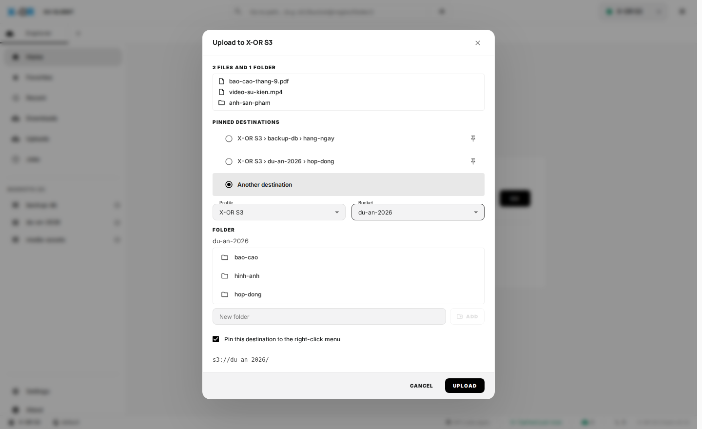
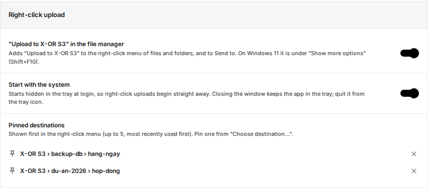

<p align="center">
  
</p>

<h1 align="center">X-OR S3 Client</h1>

<p align="center">
  Ứng dụng desktop để quản lý dữ liệu trên <b>X-OR Object Storage</b> ngay trên máy tính cá nhân.<br>
  Chuột phải vào file trong Explorer / Finder để tải thẳng lên bucket.<br>
  macOS · Windows · Linux
</p>

> Trang này chứa **bộ cài đặt** và **hướng dẫn sử dụng** X-OR S3 Client. Tải về không cần tài khoản GitHub.


## Mục lục

1. [Cài đặt](#1-cài-đặt)
2. [Kết nối X-OR Object Storage](#2-kết-nối-x-or-object-storage)
3. [Duyệt bucket và thư mục](#3-duyệt-bucket-và-thư-mục)
4. [Tải lên và tải xuống](#4-tải-lên-và-tải-xuống)
5. [Tải lên bằng chuột phải, không cần mở ứng dụng](#5-tải-lên-bằng-chuột-phải)
6. [Xem và sửa file](#6-xem-và-sửa-file)
7. [Thao tác với file: chia sẻ link, đổi tên, xoá](#7-thao-tác-với-file)
8. [Đồng bộ thư mục từ máy lên bucket](#8-đồng-bộ-thư-mục)
9. [Cài đặt ứng dụng](#9-cài-đặt-ứng-dụng)
10. [Xử lý sự cố](#10-xử-lý-sự-cố)

---

## 1. Cài đặt

Tải bộ cài theo máy của bạn. Các link luôn trỏ tới phiên bản mới nhất ([tất cả phiên bản](https://github.com/X-OR-Cloud/xor-s3-client-releases/releases)):

| Hệ điều hành | Tải về |
| --- | --- |
| macOS chip Intel | [xor-s3-client_macos_x64.dmg](https://github.com/X-OR-Cloud/xor-s3-client-releases/releases/latest/download/xor-s3-client_macos_x64.dmg) |
| macOS Apple Silicon (M1–M4) | [xor-s3-client_macos_arm64.dmg](https://github.com/X-OR-Cloud/xor-s3-client-releases/releases/latest/download/xor-s3-client_macos_arm64.dmg) |
| Windows 10/11 | [xor-s3-client_windows_x64-setup.exe](https://github.com/X-OR-Cloud/xor-s3-client-releases/releases/latest/download/xor-s3-client_windows_x64-setup.exe) hoặc [.msi](https://github.com/X-OR-Cloud/xor-s3-client-releases/releases/latest/download/xor-s3-client_windows_x64.msi) |
| Windows (không cần cài) | [xor-s3-client_windows_x64-portable.zip](https://github.com/X-OR-Cloud/xor-s3-client-releases/releases/latest/download/xor-s3-client_windows_x64-portable.zip) |
| Ubuntu / Debian | [xor-s3-client_linux_amd64.deb](https://github.com/X-OR-Cloud/xor-s3-client-releases/releases/latest/download/xor-s3-client_linux_amd64.deb) |
| Fedora / RHEL | [xor-s3-client_linux_x86_64.rpm](https://github.com/X-OR-Cloud/xor-s3-client-releases/releases/latest/download/xor-s3-client_linux_x86_64.rpm) |
| Linux khác | [xor-s3-client_linux_amd64.AppImage](https://github.com/X-OR-Cloud/xor-s3-client-releases/releases/latest/download/xor-s3-client_linux_amd64.AppImage) |
| Linux ARM64 | [deb](https://github.com/X-OR-Cloud/xor-s3-client-releases/releases/latest/download/xor-s3-client_linux_arm64.deb) · [rpm](https://github.com/X-OR-Cloud/xor-s3-client-releases/releases/latest/download/xor-s3-client_linux_aarch64.rpm) · [AppImage](https://github.com/X-OR-Cloud/xor-s3-client-releases/releases/latest/download/xor-s3-client_linux_aarch64.AppImage) |

Mã kiểm tra SHA-256 của từng file: [SHA256SUMS.txt](https://github.com/X-OR-Cloud/xor-s3-client-releases/releases/latest/download/SHA256SUMS.txt).

**macOS:** mở file `.dmg`, kéo **X-OR S3 Client** vào thư mục **Applications**, rồi mở từ Launchpad. Ứng dụng đã được ký bằng chứng thư Developer ID của X-OR Cloud và được Apple công chứng (notarized), nên mở được ngay mà không cần thao tác thêm.

**Windows:** chạy file `-setup.exe`, sau đó mở **X-OR S3 Client** từ Start menu. Nếu Windows SmartScreen hiện cảnh báo, chọn **More info → Run anyway**. Bộ cài đã kèm sẵn WebView2 nên cài được cả trên máy không có Internet.

**Linux:**

```bash
sudo apt install ./xor-s3-client_linux_amd64.deb      # Ubuntu / Debian
sudo dnf install ./xor-s3-client_linux_x86_64.rpm     # Fedora / RHEL
```

Sau khi cài, mở **X-OR S3 Client** từ menu ứng dụng. Với AppImage: `chmod +x xor-s3-client_linux_amd64.AppImage` rồi chạy trực tiếp.

**Nhúng link tải vào website:** các link trong bảng trên là cố định và luôn trỏ tới bản mới nhất, nên chỉ cần nhúng một lần, ví dụ:

```html
<a href="https://github.com/X-OR-Cloud/xor-s3-client-releases/releases/latest/download/xor-s3-client_macos_x64.dmg">Tải X-OR S3 Client cho macOS (Intel)</a>
```

## 2. Kết nối X-OR Object Storage

Ứng dụng đã cài sẵn endpoint X-OR Object Storage (`https://s3.xorcloud.net`). Bạn chỉ cần **Access Key ID** và **Secret Access Key** do X-OR Cloud cấp.


1. Mở ứng dụng, bấm **CONNECT ACCOUNT**, sau đó **CREATE NEW PROFILE**.
2. Form mở sẵn kiểu kết nối **X-OR Object Storage (s3.xorcloud.net)** với tên profile `X-OR S3`. Nhập:

   | Trường | Nhập |
   | --- | --- |
   | Access Key ID | Access key X-OR cấp |
   | Secret Access Key | Secret key X-OR cấp |
   | Profile Name | Giữ `X-OR S3` hoặc đặt tên khác, ví dụ `X-OR S3 · Dự án A` |
   | Default Region | Giữ `default` (mặc định của X-OR Object Storage) |

3. Bấm **TEST CONNECTION** để kiểm tra, rồi **CONNECT ACCOUNT** để lưu.


Cần kết nối tới một S3 khác (MinIO, AWS…)? Đổi **Authentication Method** sang **Custom S3 / Compatibility Mode** và nhập endpoint riêng.

> Secret Access Key được lưu trong kho khoá của hệ điều hành (Keychain trên macOS, Credential Manager trên Windows, Secret Service trên Linux), không lưu dạng văn bản thường.

Có thể thêm nhiều kết nối (ví dụ môi trường thử nghiệm và chính thức) và chuyển qua lại bằng ô chọn profile ở góc trên bên phải.

## 3. Duyệt bucket và thư mục

- **Thanh bên trái** liệt kê các bucket của profile đang chọn. Bấm vào một bucket để mở.
- **Bấm vào thư mục** để đi vào bên trong, dùng nút ← để quay lại.
- **Ô đường dẫn** phía trên cho phép đi thẳng tới một vị trí, ví dụ `s3://du-an-2026/bao-cao/`. Cách này cũng dùng được khi tài khoản của bạn chỉ có quyền vào một số bucket nhất định.
- **Search current folder** tìm theo tên trong thư mục hiện tại. Tick **Deep Search** để tìm cả trong các thư mục con.
- Bấm vào tên cột để sắp xếp theo tên, dung lượng hoặc ngày sửa.
- Bấm ☆ cạnh bucket hoặc thư mục để đưa vào **Favorites**. Mục **Recent** lưu các vị trí đã mở gần đây.

## 4. Tải lên và tải xuống

**Tải lên:** bấm **UPLOAD** và chọn:

- **Files**: chọn một hoặc nhiều file
- **Folder**: tải cả thư mục, giữ nguyên cấu trúc
- **Import from URLs**: tải file từ đường link trên mạng vào bucket
- **Sync local folder...**: đồng bộ một thư mục trên máy (xem [mục 8](#8-đồng-bộ-thư-mục))

Bạn cũng có thể kéo thả file hoặc thư mục từ máy vào cửa sổ ứng dụng.


**Tải xuống:** bấm nút **⋮** ở cuối dòng và chọn **Download**. Với thư mục, chọn **Download Folder**. Muốn tải nhiều mục một lúc, tick ô bên trái các dòng rồi dùng thanh thao tác hàng loạt.

**Theo dõi tiến độ:** mục **Uploads** và **Downloads** ở thanh bên hiển thị tốc độ, phần trăm và thời gian của từng file. Ô **Transfers** ở góc dưới bên phải cho biết số tác vụ đang chạy.


**File lớn (trên 100 MB)** được chia thành nhiều phần (part) và tải lên song song, mặc định 4 phần cùng lúc:

- Một phần bị lỗi mạng thì chỉ phần đó được gửi lại, không phải tải lại cả file.
- Mất mạng lâu, tắt ứng dụng hay tắt máy giữa chừng: các phần đã lên bucket được giữ lại. Lần mở ứng dụng sau, việc tải lên **tự tiếp tục** từ phần còn thiếu. Nếu tác vụ đã báo lỗi, bấm **Retry** để tải tiếp.
- Nếu file trên máy bị sửa trong lúc đang tải, ứng dụng dừng lại và báo lỗi, không ghép lẫn nội dung cũ và mới.
- Ứng dụng không bao giờ ghi đè một file đã có sẵn trên bucket khi tải lên.

## 5. Tải lên bằng chuột phải

Không cần mở cửa sổ ứng dụng: chọn file hoặc thư mục trong trình quản lý file của máy, chuột phải và chọn **Upload to X-OR S3**. Ứng dụng chạy ẩn ở khay hệ thống (thanh menu trên macOS) và tải lên ở đó.

Menu **Upload to X-OR S3** có:

- **Các đích đã ghim** (tối đa 5), ví dụ `X-OR S3 › backup-db › hang-ngay`. Chọn một đích là file bắt đầu tải lên ngay, không hỏi gì thêm.
- **Choose destination…**: mở cửa sổ để chọn profile, bucket và thư mục đích.



Trong cửa sổ **Upload to X-OR S3**:

1. Chọn một đích đã ghim, hoặc **Another destination** để chọn **Profile**, **Bucket** rồi bấm vào thư mục để đi vào. Gõ tên vào ô **New folder** và bấm **ADD** để tải vào một thư mục mới.
2. Giữ tick **Pin this destination to the right-click menu** nếu muốn lần sau chọn thẳng đích này từ menu chuột phải.
3. Bấm **UPLOAD**. Thư mục được tải lên kèm cấu trúc bên trong, ví dụ thư mục `anh-san-pham` vào `du-an-2026/` thành `du-an-2026/anh-san-pham/...`.

**Vị trí menu trên từng hệ điều hành:**

| Hệ điều hành | Cách mở |
| --- | --- |
| Windows 10 | Chuột phải vào file/thư mục → **Upload to X-OR S3** |
| Windows 11 | Chuột phải → **Show more options** (hoặc giữ Shift khi chuột phải) → **Upload to X-OR S3**. Cách khác: chuột phải → **Send to → Upload to X-OR S3** |
| macOS | Chuột phải trong Finder → **Quick Actions** → **Upload to X-OR S3…** hoặc **Upload to X-OR S3 › *đích đã ghim***. Cũng có thể kéo file thả vào biểu tượng ứng dụng trên Dock, hoặc **Open With → X-OR S3 Client** |
| Ubuntu (GNOME Files) | Chuột phải → **Scripts** → **Upload to X-OR S3** |
| KDE (Dolphin) | Chuột phải → **Actions** → **Upload to X-OR S3** |

Chọn nhiều file một lúc cũng được: ứng dụng gom thành một lần tải lên.

**Khay hệ thống:** biểu tượng X-OR ở khay (góc dưới bên phải trên Windows, thanh menu trên macOS) cho biết tiến độ chung khi đang tải. Khi xong, hệ điều hành hiện thông báo. Bấm vào biểu tượng để mở lại cửa sổ.

- Đóng cửa sổ ứng dụng **không** thoát ứng dụng; nó vẫn chạy ở khay để tiếp tục tải. Muốn thoát hẳn, chuột phải biểu tượng ở khay → **Quit X-OR S3 Client**.
- Ứng dụng tự khởi động (ẩn ở khay) khi đăng nhập máy, để menu chuột phải dùng được ngay.

Bật/tắt menu chuột phải, tự khởi động và quản lý các đích đã ghim ở **Settings → Right-click upload**:



## 6. Xem và sửa file

Bấm biểu tượng 👁 để xem trước ảnh, video, âm thanh, PDF và file văn bản. Dùng **PREVIOUS / NEXT** để chuyển qua file khác trong cùng thư mục.

Với file văn bản (txt, json, yaml, code…), bấm **EDIT FILE** để sửa trực tiếp và lưu lại lên bucket. Nếu file đã bị người khác thay đổi trong lúc bạn sửa, ứng dụng sẽ báo và không ghi đè.


## 7. Thao tác với file

Bấm **⋮** ở cuối mỗi dòng để mở menu:

| Mục | Dùng để |
| --- | --- |
| Download | Tải file về máy |
| Properties | Xem và sửa Content-Type, metadata |
| Version history | Xem và khôi phục phiên bản cũ (nếu bucket bật versioning) |
| Copy public URL | Lấy link công khai (khi bucket cho phép truy cập public) |
| Permissions | Xem và đặt quyền truy cập (ACL) |
| Get Presigned URL | Tạo link chia sẻ có thời hạn, người nhận không cần tài khoản |
| Copy Filename / Key / S3 URI | Sao chép tên hoặc đường dẫn |
| Rename / Delete | Đổi tên hoặc xoá (có xác nhận trước khi xoá) |


Muốn tạo thư mục mới, bấm **NEW FOLDER**. Muốn sao chép file sang một tài khoản hoặc bucket khác, chọn file, bấm sao chép, chuyển sang profile đích rồi dán.

## 8. Đồng bộ thư mục

Dùng tính năng này để sao lưu một thư mục trên máy lên bucket.

1. Mở bucket hoặc thư mục đích, bấm **UPLOAD → Sync local folder...**
2. **CHOOSE FOLDER** để chọn thư mục trên máy. Có thể lọc file bằng *Include patterns* / *Exclude patterns*.
3. Bấm **PREVIEW CHANGES**. Ứng dụng liệt kê file mới, file đã thay đổi và file giữ nguyên. Bước này chưa tải gì lên.
4. Kiểm tra danh sách. Nếu có file sẽ bị ghi đè, tick ô xác nhận, rồi bấm **START SYNC**.


Đồng bộ chỉ chép một chiều từ máy lên bucket, **không bao giờ xoá** file trên máy hay trên bucket.

Bấm **SAVE AS A JOB** để lưu lại và chạy định kỳ (ví dụ mỗi giờ). Các job được quản lý ở mục **Jobs** và chạy khi ứng dụng đang chạy, kể cả khi ẩn ở khay hệ thống.

## 9. Cài đặt ứng dụng

Mở **Settings** ở thanh bên:

- **Theme**: giao diện Sáng, Tối hoặc theo hệ thống. Nút ☀/☾ ở góc trên bên phải đổi nhanh.
- **Right-click upload**: bật/tắt menu **Upload to X-OR S3** trong trình quản lý file, tự khởi động cùng máy, và bỏ ghim các đích (xem [mục 5](#5-tải-lên-bằng-chuột-phải)).
- **Max Concurrent Transfers**: số file tải lên/tải xuống cùng lúc.
- **Parts per large file**: số phần của một file lớn được tải lên cùng lúc (1–16, mặc định 4). Tăng lên nếu đường truyền nhanh; giảm xuống nếu mạng yếu.
- **Bandwidth per transfer**: giới hạn băng thông mỗi tác vụ (0 là không giới hạn). Khi có giới hạn, các phần của file lớn được tải lần lượt.
- **Text Preview Size Limit**: dung lượng tối đa khi xem trước file văn bản.
- **Data & Storage → Diagnostic Log File**: đường dẫn file log, dùng khi cần gửi cho bộ phận hỗ trợ. Ở đây cũng có nút xoá dữ liệu tạm (cache).


## 10. Xử lý sự cố

| Hiện tượng | Cách xử lý |
| --- | --- |
| Không kết nối được | Kiểm tra máy truy cập được `https://s3.xorcloud.net` (VPN nếu cần), Access Key và Secret đúng. Bấm **TEST CONNECTION** để xem thông báo lỗi chi tiết. |
| Kết nối được nhưng không thấy bucket | Tài khoản có thể không có quyền liệt kê bucket. Gõ thẳng `s3://ten-bucket/` vào ô đường dẫn. |
| `Access Denied` khi tải lên/xoá | Tài khoản chỉ có quyền đọc với bucket đó. Liên hệ X-OR Cloud để được cấp quyền. |
| Windows 11 không thấy **Upload to X-OR S3** | Mục này nằm trong **Show more options** (hoặc Shift + chuột phải), hoặc dùng **Send to**. Kiểm tra **Settings → Right-click upload** đang bật. |
| macOS không thấy Quick Action | Mở **System Settings → Privacy & Security → Extensions → Finder** (hoặc **Added Extensions**) và bật **Upload to X-OR S3**. Có thể cần mở lại Finder (Option + chuột phải biểu tượng Finder → Relaunch). |
| Linux không thấy menu | GNOME Files: mở lại cửa sổ Files. Dolphin: đóng hẳn Dolphin rồi mở lại. |
| Chọn đích đã ghim nhưng không thấy gì | Ứng dụng tải lên ẩn ở khay; xem tiến độ bằng cách bấm biểu tượng X-OR ở khay, mục **Uploads**. |
| Đang tải file lớn thì mất mạng hoặc tắt máy | Mở lại ứng dụng: việc tải lên tự tiếp tục từ phần còn thiếu. Nếu đã báo lỗi, bấm **Retry**. |
| Danh sách không cập nhật | Bấm nút ⟳ để tải lại. Danh sách bucket được lưu tạm 30 phút để giảm số lượt gọi API. |
| Cần gửi log cho hỗ trợ | **Settings → Data & Storage → Diagnostic Log File** để lấy đường dẫn file log. |

---

<sub>© 2026 X-OR Cloud. Các phiên bản trước: [Releases](https://github.com/X-OR-Cloud/xor-s3-client-releases/releases).</sub>
