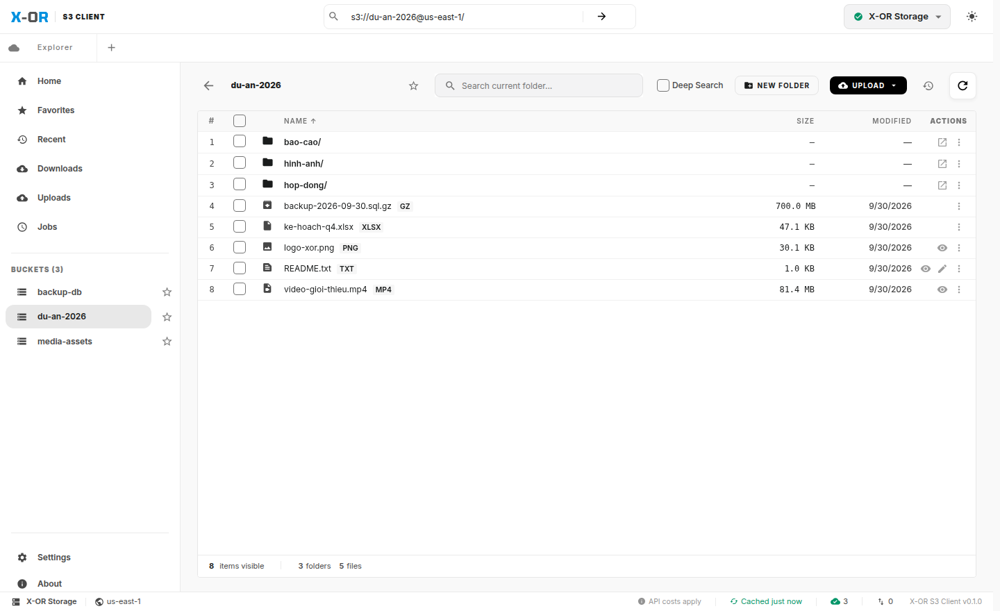
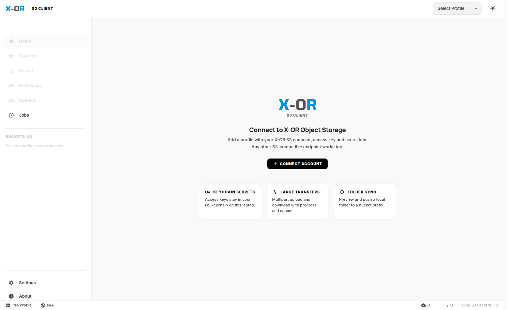
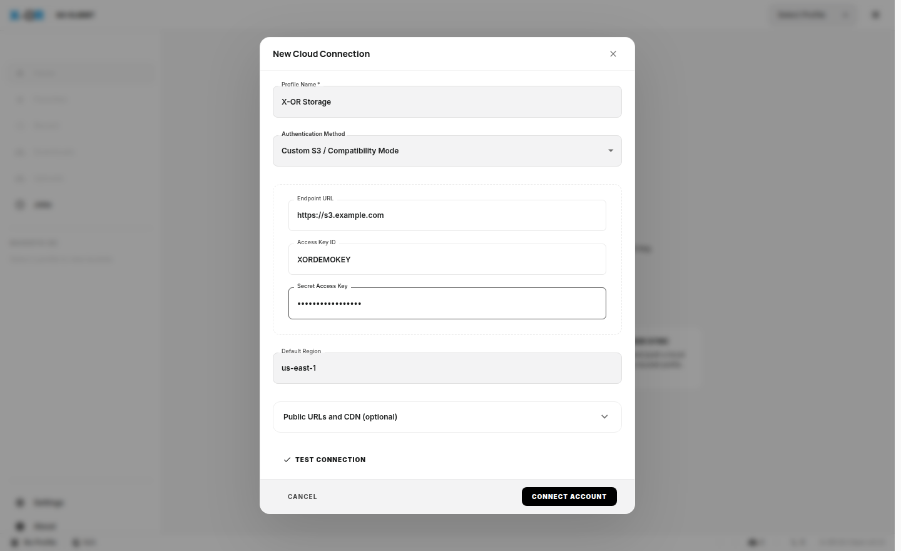
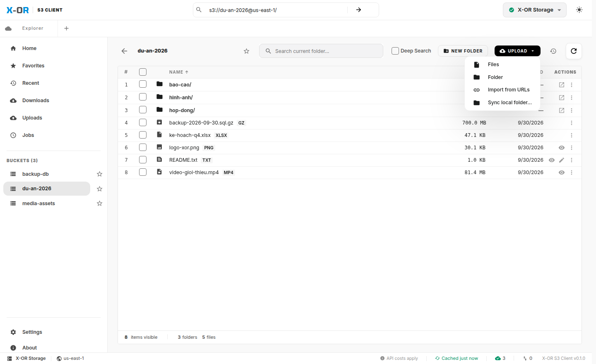
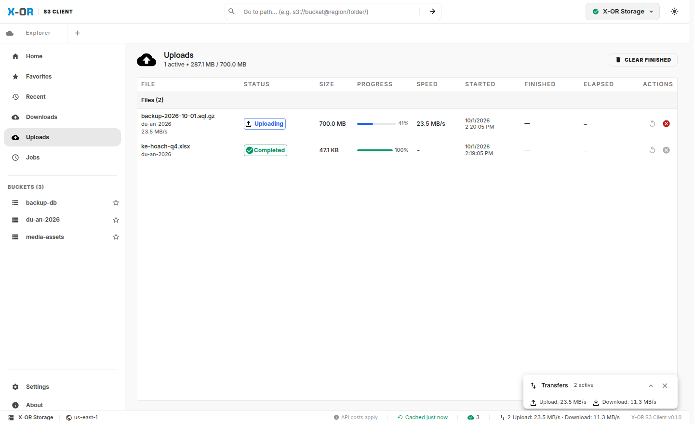
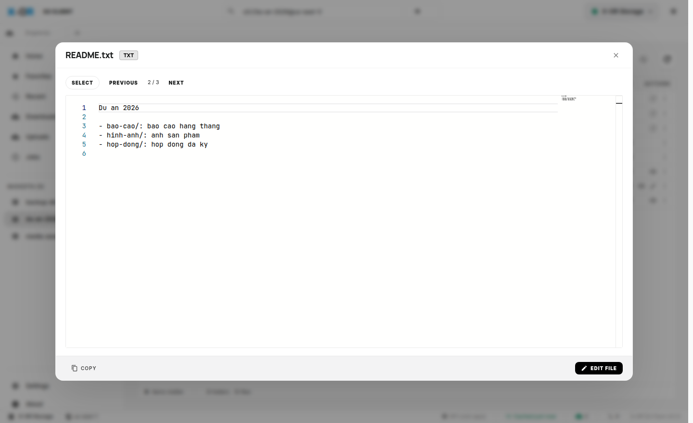
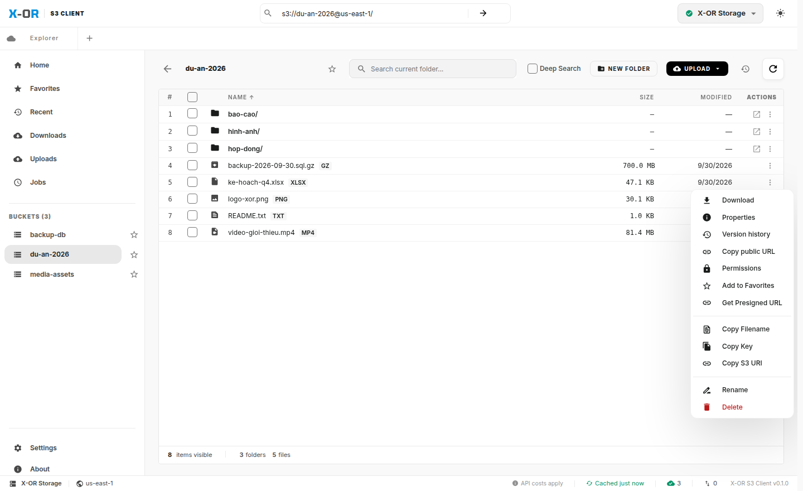
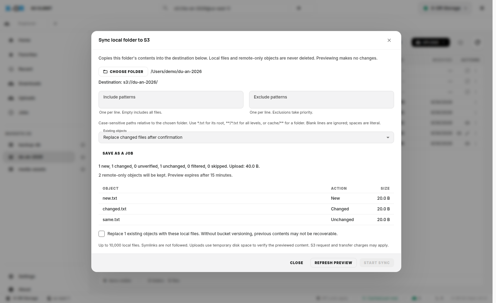
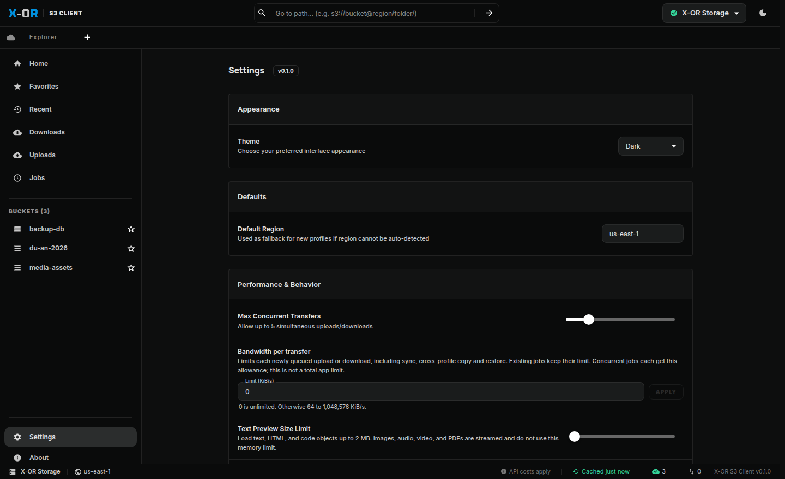

<p align="center">
  
</p>

<h1 align="center">X-OR S3 Client</h1>

<p align="center">
  Ứng dụng desktop để quản lý dữ liệu trên <b>X-OR Object Storage</b> ngay trên máy tính cá nhân.<br>
  macOS · Windows · Linux
</p>

> Trang này chứa **bộ cài đặt** và **hướng dẫn sử dụng** X-OR S3 Client. Tải về không cần tài khoản GitHub.



## Mục lục

1. [Cài đặt](#1-cài-đặt)
2. [Kết nối X-OR Object Storage](#2-kết-nối-x-or-object-storage)
3. [Duyệt bucket và thư mục](#3-duyệt-bucket-và-thư-mục)
4. [Tải lên và tải xuống](#4-tải-lên-và-tải-xuống)
5. [Xem và sửa file](#5-xem-và-sửa-file)
6. [Thao tác với file: chia sẻ link, đổi tên, xoá](#6-thao-tác-với-file)
7. [Đồng bộ thư mục từ máy lên bucket](#7-đồng-bộ-thư-mục)
8. [Cài đặt ứng dụng](#8-cài-đặt-ứng-dụng)
9. [Xử lý sự cố](#9-xử-lý-sự-cố)

---

## 1. Cài đặt

Tải bộ cài theo máy của bạn. Các link luôn trỏ tới phiên bản mới nhất ([tất cả phiên bản](https://github.com/X-OR-Cloud/xor-s3-client-releases/releases)):

| Hệ điều hành | Tải về |
| --- | --- |
| macOS chip Intel | [xor-s3-client_macos_x64.dmg](https://github.com/X-OR-Cloud/xor-s3-client-releases/releases/latest/download/xor-s3-client_macos_x64.dmg) |
| macOS Apple Silicon (M1–M4) | [xor-s3-client_macos_arm64.dmg](https://github.com/X-OR-Cloud/xor-s3-client-releases/releases/latest/download/xor-s3-client_macos_arm64.dmg) |
| Windows 10/11 | [xor-s3-client_windows_x64-setup.exe](https://github.com/X-OR-Cloud/xor-s3-client-releases/releases/latest/download/xor-s3-client_windows_x64-setup.exe) hoặc [.msi](https://github.com/X-OR-Cloud/xor-s3-client-releases/releases/latest/download/xor-s3-client_windows_x64.msi) |
| Windows (không cần cài) | [xor-s3-client_windows_x64-portable.zip](https://github.com/X-OR-Cloud/xor-s3-client-releases/releases/latest/download/xor-s3-client_windows_x64-portable.zip) |
| Ubuntu / Debian | [xor-s3-client_linux_amd64.deb](https://github.com/X-OR-Cloud/xor-s3-client-releases/releases/latest/download/xor-s3-client_linux_amd64.deb) |
| Fedora / RHEL | [xor-s3-client_linux_x86_64.rpm](https://github.com/X-OR-Cloud/xor-s3-client-releases/releases/latest/download/xor-s3-client_linux_x86_64.rpm) |
| Linux khác | [xor-s3-client_linux_amd64.AppImage](https://github.com/X-OR-Cloud/xor-s3-client-releases/releases/latest/download/xor-s3-client_linux_amd64.AppImage) |
| Linux ARM64 | [deb](https://github.com/X-OR-Cloud/xor-s3-client-releases/releases/latest/download/xor-s3-client_linux_arm64.deb) · [rpm](https://github.com/X-OR-Cloud/xor-s3-client-releases/releases/latest/download/xor-s3-client_linux_aarch64.rpm) · [AppImage](https://github.com/X-OR-Cloud/xor-s3-client-releases/releases/latest/download/xor-s3-client_linux_aarch64.AppImage) |

Mã kiểm tra SHA-256 của từng file: [SHA256SUMS.txt](https://github.com/X-OR-Cloud/xor-s3-client-releases/releases/latest/download/SHA256SUMS.txt).

**macOS:** mở file `.dmg`, kéo **X-OR S3 Client** vào thư mục **Applications**. Lần đầu mở, nếu macOS báo *"app is damaged"* hoặc *"cannot be opened"* (do bản cài chưa được Apple công chứng), mở Terminal và chạy:

```bash
xattr -dr com.apple.quarantine "/Applications/X-OR S3 Client.app"
```

**Windows:** chạy file `-setup.exe`, sau đó mở **X-OR S3 Client** từ Start menu. Nếu Windows SmartScreen hiện cảnh báo, chọn **More info → Run anyway**. Bộ cài đã kèm sẵn WebView2 nên cài được cả trên máy không có Internet.

**Linux:**

```bash
sudo apt install ./xor-s3-client_linux_amd64.deb      # Ubuntu / Debian
sudo dnf install ./xor-s3-client_linux_x86_64.rpm     # Fedora / RHEL
```

Sau khi cài, mở **X-OR S3 Client** từ menu ứng dụng. Với AppImage: `chmod +x xor-s3-client_linux_amd64.AppImage` rồi chạy trực tiếp.

**Nhúng link tải vào website:** các link trong bảng trên là cố định và luôn trỏ tới bản mới nhất, nên chỉ cần nhúng một lần, ví dụ:

```html
<a href="https://github.com/X-OR-Cloud/xor-s3-client-releases/releases/latest/download/xor-s3-client_macos_x64.dmg">Tải X-OR S3 Client cho macOS (Intel)</a>
```

## 2. Kết nối X-OR Object Storage

Bạn cần 3 thông tin do X-OR Cloud cấp: **Endpoint URL**, **Access Key ID** và **Secret Access Key**.



1. Mở ứng dụng, bấm **CONNECT ACCOUNT**, sau đó **CREATE NEW PROFILE**.
2. Điền thông tin:

   | Trường | Nhập |
   | --- | --- |
   | Profile Name | Tên gợi nhớ, ví dụ `X-OR Storage` |
   | Authentication Method | Chọn **Custom S3 / Compatibility Mode** |
   | Endpoint URL | Endpoint X-OR cấp, có `https://` ở đầu |
   | Access Key ID / Secret Access Key | Cặp khoá X-OR cấp |
   | Default Region | Giữ `us-east-1` nếu X-OR không yêu cầu khác |

3. Bấm **TEST CONNECTION** để kiểm tra, rồi **CONNECT ACCOUNT** để lưu.



> Secret Access Key được lưu trong kho khoá của hệ điều hành (Keychain trên macOS, Credential Manager trên Windows, Secret Service trên Linux), không lưu dạng văn bản thường.

Có thể thêm nhiều kết nối (ví dụ môi trường thử nghiệm và chính thức) và chuyển qua lại bằng ô chọn profile ở góc trên bên phải.

## 3. Duyệt bucket và thư mục

- **Thanh bên trái** liệt kê các bucket của profile đang chọn. Bấm vào một bucket để mở.
- **Bấm vào thư mục** để đi vào bên trong, dùng nút ← để quay lại.
- **Ô đường dẫn** phía trên cho phép đi thẳng tới một vị trí, ví dụ `s3://du-an-2026/bao-cao/`. Cách này cũng dùng được khi tài khoản của bạn chỉ có quyền vào một số bucket nhất định.
- **Search current folder** tìm theo tên trong thư mục hiện tại. Tick **Deep Search** để tìm cả trong các thư mục con.
- Bấm vào tên cột để sắp xếp theo tên, dung lượng hoặc ngày sửa.
- Bấm ☆ cạnh bucket hoặc thư mục để đưa vào **Favorites**. Mục **Recent** lưu các vị trí đã mở gần đây.

## 4. Tải lên và tải xuống

**Tải lên:** bấm **UPLOAD** và chọn:

- **Files**: chọn một hoặc nhiều file
- **Folder**: tải cả thư mục, giữ nguyên cấu trúc
- **Import from URLs**: tải file từ đường link trên mạng vào bucket
- **Sync local folder...**: đồng bộ một thư mục trên máy (xem [mục 7](#7-đồng-bộ-thư-mục))

Bạn cũng có thể kéo thả file hoặc thư mục từ máy vào cửa sổ ứng dụng.



**Tải xuống:** bấm nút **⋮** ở cuối dòng và chọn **Download**. Với thư mục, chọn **Download Folder**. Muốn tải nhiều mục một lúc, tick ô bên trái các dòng rồi dùng thanh thao tác hàng loạt.

**Theo dõi tiến độ:** mục **Uploads** và **Downloads** ở thanh bên hiển thị tốc độ, phần trăm và thời gian của từng file. Ô **Transfers** ở góc dưới bên phải cho biết số tác vụ đang chạy. File lớn được chia nhỏ để tải, có thể huỷ hoặc thử lại khi lỗi.



## 5. Xem và sửa file

Bấm biểu tượng 👁 để xem trước ảnh, video, âm thanh, PDF và file văn bản. Dùng **PREVIOUS / NEXT** để chuyển qua file khác trong cùng thư mục.

Với file văn bản (txt, json, yaml, code…), bấm **EDIT FILE** để sửa trực tiếp và lưu lại lên bucket. Nếu file đã bị người khác thay đổi trong lúc bạn sửa, ứng dụng sẽ báo và không ghi đè.



## 6. Thao tác với file

Bấm **⋮** ở cuối mỗi dòng để mở menu:

| Mục | Dùng để |
| --- | --- |
| Download | Tải file về máy |
| Properties | Xem và sửa Content-Type, metadata |
| Version history | Xem và khôi phục phiên bản cũ (nếu bucket bật versioning) |
| Copy public URL | Lấy link công khai (khi bucket cho phép truy cập public) |
| Permissions | Xem và đặt quyền truy cập (ACL) |
| Get Presigned URL | Tạo link chia sẻ có thời hạn, người nhận không cần tài khoản |
| Copy Filename / Key / S3 URI | Sao chép tên hoặc đường dẫn |
| Rename / Delete | Đổi tên hoặc xoá (có xác nhận trước khi xoá) |



Muốn tạo thư mục mới, bấm **NEW FOLDER**. Muốn sao chép file sang một tài khoản hoặc bucket khác, chọn file, bấm sao chép, chuyển sang profile đích rồi dán.

## 7. Đồng bộ thư mục

Dùng tính năng này để sao lưu một thư mục trên máy lên bucket.

1. Mở bucket hoặc thư mục đích, bấm **UPLOAD → Sync local folder...**
2. **CHOOSE FOLDER** để chọn thư mục trên máy. Có thể lọc file bằng *Include patterns* / *Exclude patterns*.
3. Bấm **PREVIEW CHANGES**. Ứng dụng liệt kê file mới, file đã thay đổi và file giữ nguyên. Bước này chưa tải gì lên.
4. Kiểm tra danh sách. Nếu có file sẽ bị ghi đè, tick ô xác nhận, rồi bấm **START SYNC**.



Đồng bộ chỉ chép một chiều từ máy lên bucket, **không bao giờ xoá** file trên máy hay trên bucket.

Bấm **SAVE AS A JOB** để lưu lại và chạy định kỳ (ví dụ mỗi giờ). Các job được quản lý ở mục **Jobs** và chỉ chạy khi ứng dụng đang mở.

## 8. Cài đặt ứng dụng

Mở **Settings** ở thanh bên:

- **Theme**: giao diện Sáng, Tối hoặc theo hệ thống. Nút ☀/☾ ở góc trên bên phải đổi nhanh.
- **Max Concurrent Transfers**: số file tải lên/tải xuống cùng lúc.
- **Bandwidth per transfer**: giới hạn băng thông mỗi tác vụ (0 là không giới hạn).
- **Text Preview Size Limit**: dung lượng tối đa khi xem trước file văn bản.
- **Data & Storage → Diagnostic Log File**: đường dẫn file log, dùng khi cần gửi cho bộ phận hỗ trợ. Ở đây cũng có nút xoá dữ liệu tạm (cache).



## 9. Xử lý sự cố

| Hiện tượng | Cách xử lý |
| --- | --- |
| Không kết nối được | Kiểm tra Endpoint URL có `https://`, máy có vào được mạng X-OR (VPN nếu cần), Access Key và Secret đúng. Bấm **TEST CONNECTION** để xem thông báo lỗi chi tiết. |
| Kết nối được nhưng không thấy bucket | Tài khoản có thể không có quyền liệt kê bucket. Gõ thẳng `s3://ten-bucket/` vào ô đường dẫn. |
| `Access Denied` khi tải lên/xoá | Tài khoản chỉ có quyền đọc với bucket đó. Liên hệ X-OR Cloud để được cấp quyền. |
| macOS báo app bị hỏng | Chạy lệnh `xattr` ở [mục 1](#1-cài-đặt). |
| Danh sách không cập nhật | Bấm nút ⟳ để tải lại. Danh sách bucket được lưu tạm 30 phút để giảm số lượt gọi API. |
| Cần gửi log cho hỗ trợ | **Settings → Data & Storage → Diagnostic Log File** để lấy đường dẫn file log. |

---

<sub>© 2026 X-OR Cloud. Các phiên bản trước: [Releases](https://github.com/X-OR-Cloud/xor-s3-client-releases/releases).</sub>
